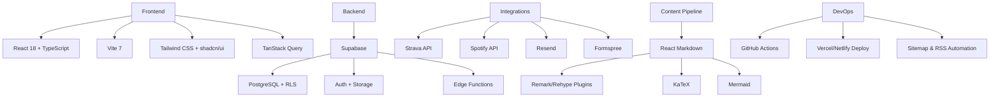

<div align="center">
  
  <h1>imadlab: Data & AI Systems Portfolio</h1>
</div>

## Overview

imadlab showcases how I design, build, and run data-heavy web systems end to end. A React 18 + TanStack Query front end sits on top of Supabase services, custom analytics, and automation scripts so the site stays fast, interactive, and always up to date.

**Live Demo:** [imadlab.me](https://imadlab.me) | **Source:** [github.com/imaddde867/imadlab](https://github.com/imaddde867/imadlab)

## Quick Start

```bash
git clone https://github.com/imaddde867/imadlab.git
cd imadlab
npm install
cp .env.example .env  # set Strava credentials for Edge Functions
npm run dev
```

- Optional: copy `supabase/.env.local` to configure Supabase CLI or create your own with project keys.
- Useful scripts: `npm run lint`, `npm run typecheck`, `npm run build`.

## Feature Highlights

- **Content & Publishing** - Supabase-backed projects and blog with shadcn/ui admin tools, staged drafts, rich Markdown (GFM, KaTeX, Mermaid), RSS feed, and sitemap generation.
- **Real-Time Integrations** - Running dashboards powered by Strava Edge Functions with multi-layer caching, Spotify Now Playing, and newsletter forms with automatic tagging.
- **Automation & Email Ops** - Newsletter queue processed by Supabase Edge Functions, Resend templates, inbound webhooks, unsubscribe tokens, and retry-aware delivery.
- **Privacy-Aware Analytics** - Consent-gated tracking, Supabase storage for sessions/page views, geolocation enrichment via Edge Functions, and an internal analytics dashboard with period filtering.
- **Experience & DX** - React Query data fetching, route prefetch, custom cursor/interaction effects, Tailwind + shadcn/ui components, and structured logging for observability.

<video src="https://raw.githubusercontent.com/imaddde867/imadlab/master/doc/admin_demo.mov" controls width="100%" style="border-radius:12px;margin-top:20px;"></video>

## Technology Stack



## Project Layout

```bash
src/
|-- components/      # UI + animations (Hero, Projects, Markdown, analytics, running dashboards)
|-- hooks/           # Analytics, intersection observers, motion preferences, toasts
|-- integrations/    # Supabase and Strava clients with caching helpers
|-- lib/             # Utilities, analytics helpers, consent, logging, prerender data
|-- pages/           # Public pages and admin surfaces (blog, projects, dashboards, extras)
|-- types/           # Shared TypeScript types for content and integrations
`-- App.tsx          # Route definitions

supabase/
|-- functions/       # Edge Functions (strava-proxy, spotify-now-playing, newsletters, geolocation)
`-- migrations/      # Database schema, policies, and triggers

scripts/
|-- generate-sitemap.js
|-- generate-feed.js
`-- prerender.js     # Injects prerendered markup + data into build output
```

## Edge Functions & Automation

- `strava-proxy`: Authenticates with Strava, caches requests, and serves stats/activities to the Extras page.
- `spotify-now-playing`: Refreshes Spotify tokens and returns the current track with CDN-friendly caching.
- `send-newsletter-emails`, `email-webhook`, `handle-unsubscribe`: Manage outbound campaigns, inbound events, and subscriber preferences.
- `geolocation`: Enriches analytics sessions with country/region/city metadata.
- Build hooks (`generate-sitemap`, `generate-feed`, `prerender`) keep SEO assets, RSS, and static shells current on every deploy.

## Development Notes

- Fill `.env` and Supabase secrets before invoking Edge Functions locally.
- Analytics honors the cookie consent gate; when disabled, no data leaves the browser.
- Newsletter and contact workflows require Resend + Formspree credentials to send real email.
- Linting (`npm run lint`) and type checks (`npm run typecheck`) guard pull requests; CI mirrors the same commands.

## Impact

- Demonstrates full-stack ownership across data ingestion, content ops, and UX polish.
- Privacy-compliant analytics with consent handling, geolocation enrichment, and admin visibility.
- Resilient API integrations with rate-limit-aware caching, retries, and graceful fallbacks.
- Newsletter automation, Strava dashboards, and Spotify presence showcase real-time storytelling.
- Consistent performance (Lighthouse 95+) and responsive design tuned for modern devices.

---

<div align="center" style="margin-top: 40px;">
  <a href="https://imadlab.me">
    
  </a>
</div>
