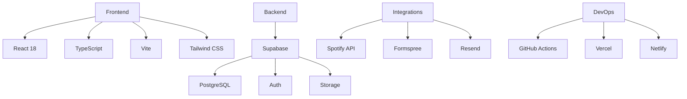

<div align="center">
  
  <h1>imadlab: A Next-Gen Developer Portfolio</h1>
  <p>Where Data Engineering Meets Cutting-Edge Web Development</p>
</div>

## Overview

imadlab is a production-ready portfolio that shows how I design and operate data-centric web systems. The site combines a React 18 front end with Supabase services, automated publishing flows, and real-time integrations—all tuned for fast performance and clean operations.

**Live Demo:** [imadlab.me](https://imadlab.me) · **Source:** [github.com/imaddde867/imadlab](https://github.com/imaddde867/imadlab)

## Quick Start

```bash
git clone https://github.com/imaddde867/imadlab.git
cd imadlab
npm install
npm run dev
```

## Highlights

<div style="display: grid; grid-template-columns: repeat(auto-fit, minmax(300px, 1fr)); gap: 20px; margin: 30px 0;">

### Portfolio Delivery
- Dynamic project filtering and deep-dive case studies
- Cross-platform responsive layouts and design tokens
- Automated sync with GitHub repos and hosted demos

### Publishing Pipeline
- Markdown authoring with analytics-aware metadata
- Secure admin workflow with previews and staged deploys
- SEO-first rendering (OpenGraph, sitemap, schema.org)

### Operations & Automations
<video src="https://raw.githubusercontent.com/imaddde867/imadlab/master/doc/admin_demo.mov" controls width="100%" style="border-radius:12px;"></video>

- Newsletter queue with retries, analytics, and unsubscribe handling
- Spotify, Formspree, and Resend integrations
- Supabase Edge Functions for background jobs and telemetry
</div>

## Technology Stack



## Architecture

```bash
src/
├── components/      # Reusable UI library (shadcn-based)
├── hooks/           # Data fetching and UI state
├── integrations/    # Supabase and external API clients
├── lib/             # Utilities, analytics, consent management
└── pages/           # Route-level views and admin surfaces
```

Key patterns:

- Supabase Edge Functions send newsletters, track webhooks, and manage auth
- React Query drives fetching with caching, suspense, and optimistic updates
- Typed Supabase schemas keep the database and UI in sync
- Automated migrations, linting, and CI guardrails ensure consistency

## Impact

imadlab demonstrates:

- End-to-end ownership of a cloud-native content platform
- Secure admin tooling with robust error handling and observability
- Performance-tuned UX with Lighthouse 95+ scores
- Maintainable, extensible architecture suited for production workloads

---

<div align="center" style="margin-top: 40px;">
  <a href="https://imadlab.me">
    
  </a>
  <a href="https://github.com/imaddde867/imadlab">
    
  </a>
</div>

<p align="center">
  <a href="https://imadlab.me#contact">Contact</a> ·
  <a href="https://www.linkedin.com/in/imad-eddine-elmouss/">LinkedIn</a> ·
  <a href="https://x.com/Imaddd867">X (Twitter)</a>
</p>
