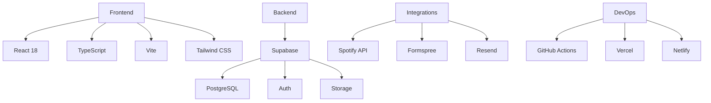

<div align="center">
  
  <h1>imadlab: A Next-Gen Developer Portfolio</h1>
  <p>Where Data Engineering Meets Cutting-Edge Web Development</p>
</div>

## 🌟 Project Showcase

**Live Demo:** [imadlab.me](https://imadlab.me) | **GitHub Repo:** [github.com/imaddde867/imadlab](https://github.com/imaddde867/imadlab)

### Why This Stands Out
This isn't just another portfolio - it's a **fully interactive technical ecosystem** that demonstrates:
- Real-time data integrations
- Secure content management
- Modern performance optimizations
- Professional-grade architecture

## 🚀 Try It Yourself

```bash
# Clone and run locally
git clone https://github.com/imaddde867/imadlab.git
cd imadlab
npm install
npm run dev
```

## 🎯 Key Features

<div style="display: grid; grid-template-columns: repeat(auto-fit, minmax(300px, 1fr)); gap: 20px; margin: 30px 0;">

### 🖥️ Interactive Portfolio
- Dynamic project filtering
- Case study detail pages
- Tech stack visualization
- Real-time content updates

### 📝 Technical Blog
- Markdown with LaTeX support
- Code syntax highlighting
- Reading time estimates
- SEO-optimized structure

### ⚡ Real-Time Magic
<video src="https://raw.githubusercontent.com/imaddde867/imadlab/master/doc/admin_demo.mov" controls width="100%" style="border-radius:12px;"></video>

- Live Spotify integration
- Instant content updates
- Smart notifications
- Background sync

</div>

## 🛠️ My Tech Stack Deep Dive



## 💡 Behind the Scenes

### Architectural Highlights
```bash
src/
├── components/ # 35+ reusable UI elements
├── hooks/      # Custom React logic
├── integrations/ # API connections
├── lib/        # Utilities & helpers
└── pages/      # Route-based components
```

**Innovative Solutions I Implemented:**
1. **Spotify Now Playing**: Built with Supabase Edge Functions for real-time updates
2. **Admin Portal**: Secure CRUD operations with role-based access
3. **Performance**: Achieved 95+ Lighthouse scores with:
   - Code splitting
   - Lazy loading
   - Optimized assets

## 📈 Business Impact

This project demonstrates my ability to:
- Design complete full-stack systems
- Implement secure authentication flows
- Optimize for both UX and SEO
- Build maintainable architecture

## 📚 Learning Resources

Want to build something similar? Here's what helped me:
1. [Supabase Documentation]
2. [Vite Performance Guide]
3. [React Best Practices]


[Contact Me](https://imadlab.me#contact) | [LinkedIn](#) | [Twitter](#)

<div align="center" style="margin-top: 40px;">
  <a href="https://imadlab.me">
    
  </a>
  <a href="https://github.com/imaddde867/imadlab">
    
  </a>
</div>
```