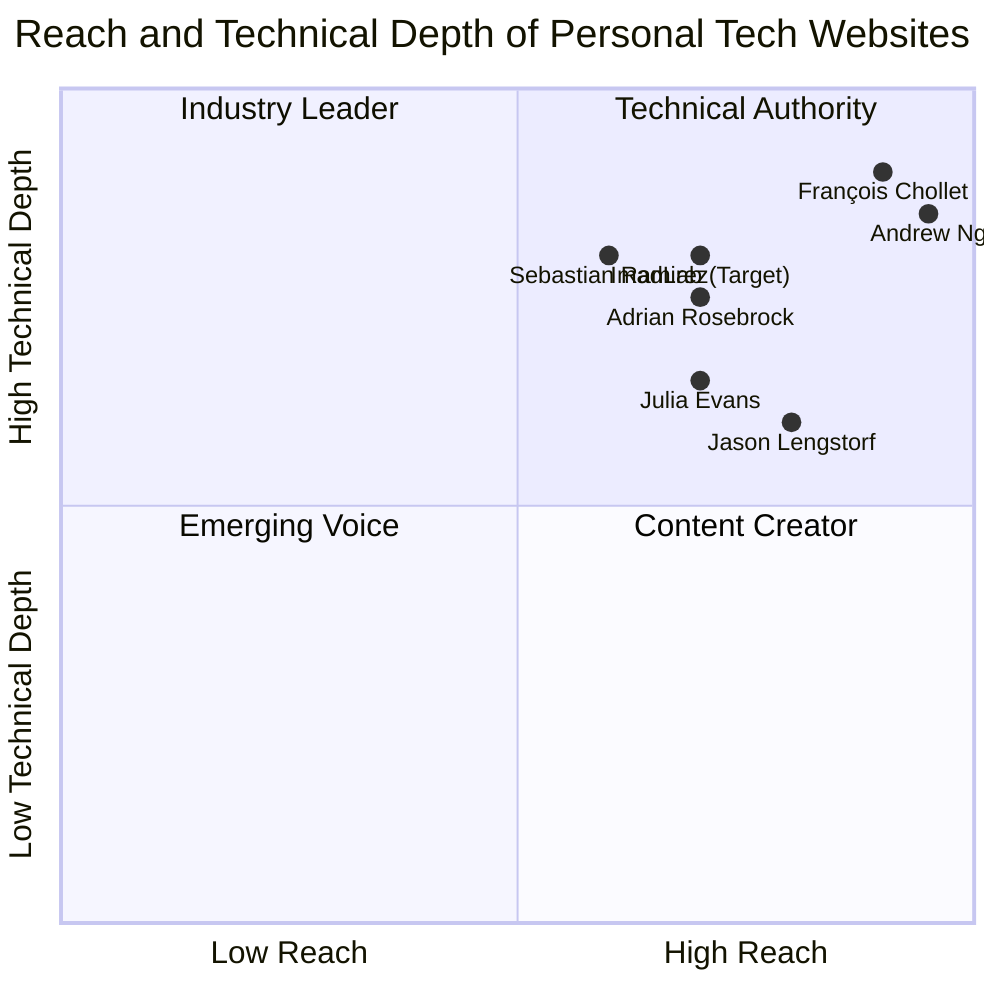
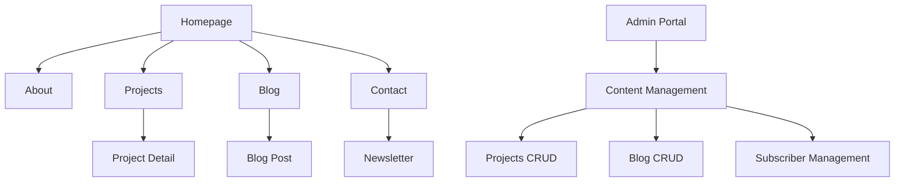

# Product Requirements Document: ImadLab Personal Website

## 1. Project Overview

### 1.1 Project Information
- **Project Name**: imadlab
- **Programming Stack**: React, JavaScript, Tailwind CSS (Frontend), FastAPI (Backend), PostgreSQL (Database)
- **Target Launch Date**: Q2 2025

### 1.2 Original Requirements
Create a modern, dark-themed personal website for a Data Engineering and AI student/researcher named Imad, featuring an about section, projects portfolio, blog, newsletter integration, and admin portal.

## 2. Product Definition

### 2.1 Product Goals
1. Establish a professional online presence that showcases Imad's expertise in AI, Data Engineering, and Cloud Solutions
2. Create an engaging platform for knowledge sharing through blog posts and project demonstrations
3. Build a community around AI and Data Engineering through newsletter engagement

### 2.2 User Stories
1. As a potential employer, I want to quickly understand Imad's technical capabilities and project experience so that I can evaluate his fit for job opportunities
2. As a fellow developer, I want to read detailed technical blog posts about AI and Data Engineering so that I can learn from Imad's experiences
3. As a student, I want to explore Imad's project portfolio so that I can understand real-world applications of AI and Data Engineering
4. As a visitor, I want to subscribe to the newsletter so that I can stay updated with Imad's latest insights and projects
5. As the site owner, I want to easily manage content through an admin portal so that I can keep the website updated without coding

### 2.3 Competitive Analysis

#### Similar Personal Websites/Portfolios:
1. **Sebastian Ramirez (FastAPI Creator)**
   - Pros: Clean documentation, excellent technical writing
   - Cons: Limited interactive features

2. **François Chollet (Keras Creator)**
   - Pros: Strong thought leadership, engaging blog
   - Cons: Minimal project showcase

3. **Adrian Rosebrock (PyImageSearch)**
   - Pros: Rich technical content, strong newsletter
   - Cons: Dense layout, overwhelming information

4. **Jason Lengstorf (Learn With Jason)**
   - Pros: Modern design, excellent UX
   - Cons: Limited technical depth

5. **Julia Evans (wizard zines)**
   - Pros: Unique visual style, engaging content
   - Cons: Limited portfolio features

6. **Andrew Ng's Landing Page**
   - Pros: Clear professional positioning
   - Cons: Limited interaction, basic design

7. **Our Target Product (ImadLab)**
   - Combining modern design with deep technical content
   - Focus on AI/ML and Data Engineering
   - Interactive project showcases
   - Newsletter integration

### 2.4 Competitive Quadrant Chart


```mermaid
quadrantChart
    title Reach and Technical Depth of Personal Tech Websites
    x-axis Low Reach --> High Reach
    y-axis Low Technical Depth --> High Technical Depth
    quadrant-1 Technical Authority
    quadrant-2 Industry Leader
    quadrant-3 Emerging Voice
    quadrant-4 Content Creator
    "Sebastian Ramirez": [0.6, 0.8]
    "François Chollet": [0.9, 0.9]
    "Adrian Rosebrock": [0.7, 0.75]
    "Jason Lengstorf": [0.8, 0.6]
    "Julia Evans": [0.7, 0.65]
    "Andrew Ng": [0.95, 0.85]
    "ImadLab (Target)": [0.7, 0.8]
```

## 3. Technical Specifications

### 3.1 Frontend Requirements

#### 3.1.1 Design System
- **Theme**: Dark mode with accent colors
  - Primary: #3584E4 (Blue from GitHub profile)
  - Background: #0D1117 (Dark)
  - Text: #F0F6FC (Light)
  - Accent: #FF6F00 (TensorFlow orange)
- **Typography**:
  - Headings: Inter (Bold)
  - Body: Inter (Regular)
  - Code: JetBrains Mono
- **Responsive Design**:
  - Mobile-first approach
  - Breakpoints: 640px, 768px, 1024px, 1280px

#### 3.1.2 Components Layout

##### Header
- Sticky navigation bar
- Dynamic scroll behavior
- Links: About, Projects, Blog, Contact
- Dark/Light theme toggle (optional)

##### About Section
MUST include:
- Hero section with typing animation
- Professional summary
- Expertise areas with icons
- Technical stack display
- Language proficiency
- Education and certifications
- Download CV option

##### Projects Portfolio
MUST include:
- Grid layout for projects
- Project cards with:
  - Preview image
  - Title
  - Tech stack badges
  - Brief description
- Detailed project page with:
  - Project overview
  - Technical details
  - Challenge & solution
  - Live demo link (if applicable)
  - GitHub repository link
  - Image gallery/video demos
  - Technologies used

##### Blog Section
MUST include:
- Article cards with:
  - Featured image
  - Title
  - Publication date
  - Read time estimate
  - Category tags
- Full article view with:
  - Rich text formatting
  - Code syntax highlighting
  - Image support
  - Table of contents
  - Share buttons
  - Related articles

##### Newsletter
MUST include:
- Subscription form
- GDPR compliance notice
- Success/error messages
- Preview of benefits

##### Admin Portal
MUST include:
- Secure login page
- Dashboard with analytics
- Content management for:
  - Projects CRUD
  - Blog posts CRUD
  - Newsletter subscribers
- Rich text editor
- Image upload functionality
- Draft/publish workflow

### 3.2 Backend Requirements

#### 3.2.1 API Architecture
- REST API with FastAPI
- JWT authentication for admin
- Rate limiting
- CORS configuration

#### 3.2.2 Database Schema

**Projects Table:**
```sql
CREATE TABLE projects (
    id SERIAL PRIMARY KEY,
    title VARCHAR(255) NOT NULL,
    slug VARCHAR(255) UNIQUE NOT NULL,
    description TEXT NOT NULL,
    tech_stack JSONB,
    github_url VARCHAR(255),
    demo_url VARCHAR(255),
    images JSONB,
    created_at TIMESTAMP DEFAULT CURRENT_TIMESTAMP,
    updated_at TIMESTAMP DEFAULT CURRENT_TIMESTAMP
);
```

**Blog Posts Table:**
```sql
CREATE TABLE blog_posts (
    id SERIAL PRIMARY KEY,
    title VARCHAR(255) NOT NULL,
    slug VARCHAR(255) UNIQUE NOT NULL,
    content TEXT NOT NULL,
    excerpt TEXT,
    status VARCHAR(20) DEFAULT 'draft',
    featured_image VARCHAR(255),
    tags JSONB,
    created_at TIMESTAMP DEFAULT CURRENT_TIMESTAMP,
    updated_at TIMESTAMP DEFAULT CURRENT_TIMESTAMP
);
```

**Newsletter Subscribers Table:**
```sql
CREATE TABLE subscribers (
    id SERIAL PRIMARY KEY,
    email VARCHAR(255) UNIQUE NOT NULL,
    status VARCHAR(20) DEFAULT 'active',
    subscribed_at TIMESTAMP DEFAULT CURRENT_TIMESTAMP,
    CONSTRAINT valid_email CHECK (email ~* '^[A-Za-z0-9._%-]+@[A-Za-z0-9.-]+[.][A-Za-z]+$')
);
```

**Admin Users Table:**
```sql
CREATE TABLE admin_users (
    id SERIAL PRIMARY KEY,
    username VARCHAR(50) UNIQUE NOT NULL,
    password_hash VARCHAR(255) NOT NULL,
    last_login TIMESTAMP,
    created_at TIMESTAMP DEFAULT CURRENT_TIMESTAMP
);
```

### 3.3 Requirements Pool

#### P0 (Must Have)
1. Responsive dark theme design
2. About section with professional information
3. Project portfolio with detailed project pages
4. Basic blog functionality
5. Admin authentication
6. Content management system
7. Mobile responsiveness
8. SEO optimization

#### P1 (Should Have)
1. Newsletter subscription
2. Rich text editor for blog posts
3. Image optimization
4. Code syntax highlighting
5. Social sharing buttons
6. Related content suggestions
7. Search functionality
8. Analytics dashboard

#### P2 (Nice to Have)
1. Dark/Light theme toggle
2. Comment system
3. RSS feed
4. API documentation
5. Automated backup system
6. Multi-language support
7. Progressive Web App features
8. Integration with dev.to/Medium

### 3.4 UI Design Draft

Main sections layout and navigation flow:


```mermaid
graph TD
    A[Homepage] --> B[About]
    A --> C[Projects]
    A --> D[Blog]
    A --> E[Contact]
    C --> F[Project Detail]
    D --> G[Blog Post]
    E --> H[Newsletter]
    I[Admin Portal] --> J[Content Management]
    J --> K[Projects CRUD]
    J --> L[Blog CRUD]
    J --> M[Subscriber Management]
```

## 4. Open Questions

1. Will the blog support multiple authors in the future?
2. Should we implement a comment system or integrate with a third-party solution?
3. What analytics metrics are most important to track?
4. Should we implement a caching strategy for better performance?
5. What is the expected volume of blog posts and projects to determine scaling needs?

## 5. Success Metrics

1. User Engagement:
   - Average session duration > 3 minutes
   - Pages per session > 2.5
   - Bounce rate < 40%

2. Content Performance:
   - Monthly blog post views > 1000
   - Newsletter subscription rate > 5% of visitors
   - Project page engagement > 2 minutes average

3. Technical Performance:
   - Page load time < 2 seconds
   - Mobile responsiveness score > 90
   - SEO score > 90
   - Core Web Vitals all "Good"

## 6. Timeline and Milestones

1. Phase 1 (Month 1):
   - Frontend architecture setup
   - Core pages implementation
   - Basic styling and responsiveness

2. Phase 2 (Month 2):
   - Backend API development
   - Database setup
   - Admin portal basic functionality

3. Phase 3 (Month 3):
   - Content migration
   - Newsletter integration
   - Testing and optimization
   - Launch preparation
